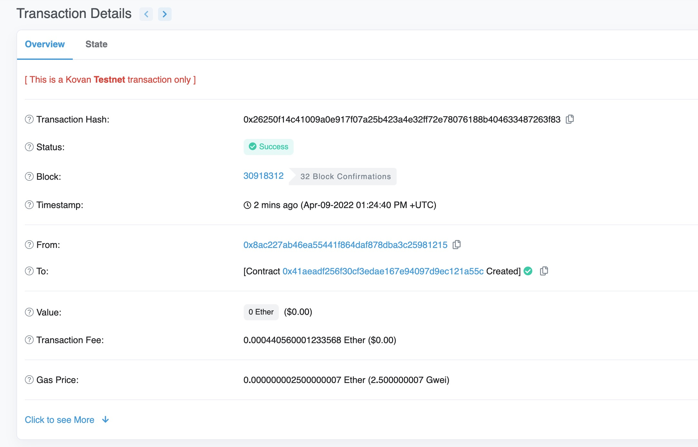

## 前言
通过本样例代码，使开发者了解合约编译，部署的基本流程，并掌握基本的 web3js 接口使用方法

- 本样例发送交易到 Infura , 需要创建相应的 Infura Project, 可以参考如下资料进行创建
https://ithelp.ithome.com.tw/articles/10202794 在成功创建 Infura Project 后，可以获取相应的PROJECT ID

- 本样例中，需要自己来生成私钥。可通过多种方式来生成私钥。常见的方式是通过Metamask。可参考《精通以太坊》或其他文档安装： https://www.bookstack.cn/read/ethereum_book-zh/spilt.4.77adf5064f4455e8.md  安装完成后，连接到Kovan测试网络，点击账户详情-导出私钥，获得创建的测试账号的私钥PRIVATE_KEY。

- 给Kovan测试网络中的测试账号充值。上一步开立的账号中，余额为0， 可通过faucets来充值： https://faucets.chain.link/kovan  每次冲入0.1Eth。
 
- 为方便代码测试, 在 .env 中放入私钥和Infura Project ID，格式为 "PRIVATE_KEY=xxxx" "INFURA_ID=yyyyyyyy", index.js代码会自动从中读取, 样例文件可参考 .env.example  

- 同时在 BiliBili 上有上传本样例代码的讲解演示:   
https://www.bilibili.com/video/BV1Y44y1r7E6/

## 合约功能说明   
constructor: 构造函数, 用于部署合约时调用, 同时在其中初始化了公共变量 number 的值  
increment:   增值函数, 根据传入的数值 ( _value ), 对公共变量 number 进行增值 ( number + _value )   
reset:       重置函数, 用于重置公共变量 number 的值为 0    
getNumber:   查询函数, 用于查询公共变量 number 当前的数值  

## 测试流程:
1)  安装依赖
```
npm install
```

2) 配置 .env
```
cp .env.example .env

## 修改 .env 中的 INFURA_ID 和 PRIVATE_KEY 为实际的值  
PRIVATE_KEY=xxxxxxxxxxxxxxxx
INFURA_ID=yyyyyyyy
```

3） 执行 index.js
```
node index.js
```
## index.js 代码逻辑说明  
1) 读取私钥  
出于安全考虑, 私钥没有进行硬编码, 而是通过环境变量的方式进行获取. 启动测试时, dotenv 插件自动读取 .env 配置文件中的配置项, 然后加载为环境变量, 之后在代码中可以通过 process.env 读取私钥 ( 也包括其他环境变量 )    
```js
require("dotenv").config();
const privatekey = process.env.PRIVATE_KEY;
```     
     
2)  编译合约    
我们无法直接使用 .sol 文件, 需要把它编译为 bin 文件 ( 二进制文件 ), 因此在代码中需要进行这一步的逻辑处理.  
- 读取文件   
第一步, 我们先进行文件的读取, 把 sol 文件加载为 source 变量 
```js

// Load contract
const source = fs.readFileSync("Incrementer.sol", "utf8");
```

- 进行合约编译    
这里进行编译动作. 把 sol 源码编译为 solidity 对象. 这里需要注意的是不同的 sol 源码版本, 编译的方式可能稍有不同, 这里因为 "Incrementer.sol" 对应的是 sol 是 0.8.0 版本, 所以我们可以使用如下的方式进行编译 
```js 
// compile solidity
const input = {
  language: "Solidity",
  sources: {
    "Incrementer.sol": {
      content: source,
    },
  },
  settings: {
    outputSelection: {
      "*": {
        "*": ["*"],
      },
    },
  },
};

const tempFile = JSON.parse(solc.compile(JSON.stringify(input)));
```

3) 获取二进制对象  
在上一步编译成功的 solidity 对象里面包含很多的属性/值, 而我们需要的是其中合约对象的二进制, abi 属性值. 如下, 我们通过属性提取方式进行获取. solidity 对象的其他属性可以通过代码调试方式进行调试, 这里不再赘述. 
```js
const contractFile = tempFile.contracts["Incrementer.sol"]["Incrementer"];

// Get bin & abi
const bytecode = contractFile.evm.bytecode.object;
const abi = contractFile.abi;
```  

4) 构造 web3 对象   
通过 web3 对象可以很方便的发送相应的交易到区块链网络, 同时获取区块链的处理结果. 
构造 web3 对象时, 主要需要传入一个参数, 就是对应的区块链网络, 包括 kovan, ropsten , rinkeby 等测试网络, 或是 mainnet 主网. 
这里我们使用 kovan 测试网络. 如果没有 kovan 网络的测试币, 可以切换到其他的测试网络. 
同时需要注意的是, 这里我们通过 infura 向对应的区块链网络发送交易, 而 INFURA_ID 这个变量值也需要配置在 .env 文件中, 具体如何获取 infura_id, 可自行搜索查找相关文档 
```js
// Create web3 with kovan provider，you can change kovan to other testnet
const web3 = new Web3(
  "https://kovan.infura.io/v3/" + process.env.INFURA_ID
);
```

5) 获取账户地址  
在区块链上, 每个用户都有一个对应的账户地址, 而这个账户地址可以通过私钥进行获取. 这里, 我们调用 web3.eth.accounts.privateKeyToAccount 接口, 传入对应的私钥, 就可以获取对应的账户地址
```js
// Create account from privatekey
const account = web3.eth.accounts.privateKeyToAccount(privatekey);
const account_from = {
  privateKey: privatekey,
  accountAddress: account.address,
};
```

6) 构造合约实例 
在步骤 3 中, 我们获取了 sol 源文件编译后的二进制 和 abi, 这里就可以使用对应的 abi 构造相应的合约实例, 以便在后续中通过合约实例进行交易的发送
```js
// Create contract instance
  const deployContract = new web3.eth.Contract(abi);
```

7) 创建合约交易   
调用 deployContract.deploy 接口, 我们创建了部署合约的二进制交易. 这里, 此交易还没有发送到区块链网络, 即合约还没有被创建  
```js
// Create Tx
  const deployTx = deployContract.deploy({
    data: bytecode,
    arguments: [5],
  });
```  

8) 交易签名 
如下使用私钥对交易进行签名,
```js
// Sign Tx
  const deployTransaction = await web3.eth.accounts.signTransaction(
    {
      data: deployTx.encodeABI(),
      gas: 8000000,
    },
    account_from.privateKey
  );
```

9) 部署合约  
这里使用发送签名后的交易到区块链网络, 同时会去返回的交易回执. 从返回的交易回执中可以得到此次部署的合约的地址 
```js
const deployReceipt = await web3.eth.sendSignedTransaction(
    deployTransaction.rawTransaction
  );
  console.log(`Contract deployed at address: ${deployReceipt.contractAddress}`);
```

## 参考文档
- Web3js官方文档：
  https://web3js.readthedocs.io/en/v1.2.11/getting-started.html
- Web3js中文文档(1.2.6):
  https://learnblockchain.cn/docs/web3.js/web3-eth-contract.html
- 样例代码参考如下链接 
  https://docs.moonbeam.network/getting-started/local-node/deploy-contract/  
- Web3js使用参考文档:  
  https://www.dappuniversity.com/articles/web3-js-intro
- 代码参考文档：
  https://docs.moonbeam.network/getting-started/local-node/deploy-contract/
- nodejs参考文档：
  http://nodejs.cn/api/fs.html
  
## 结果记录  

部署完成  

